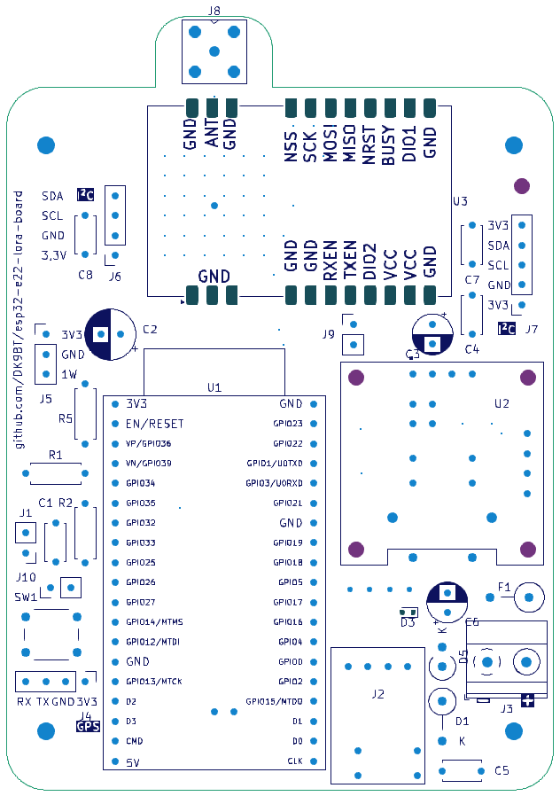
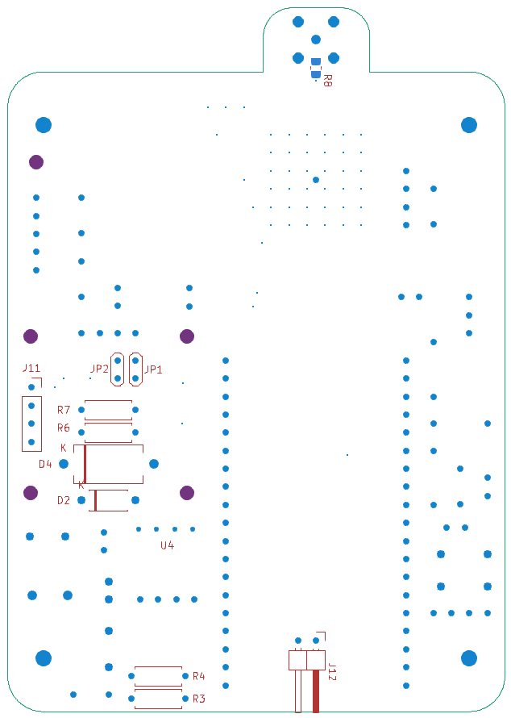
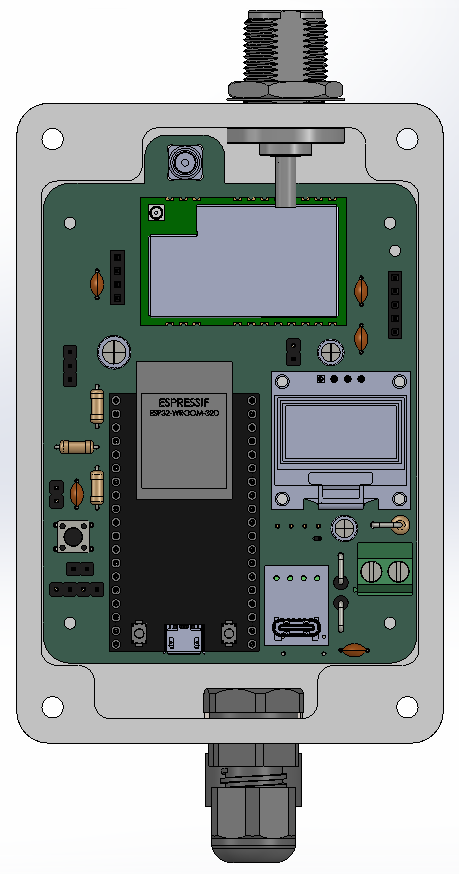
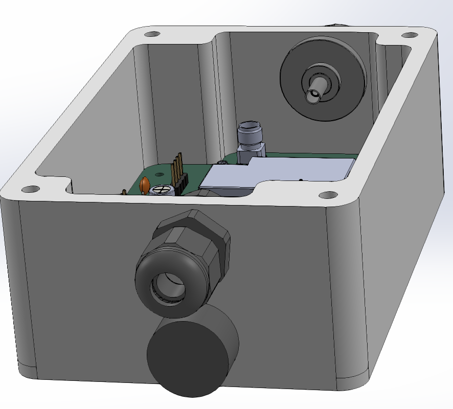

### PDF files for easier viewing

**SCH** = schematic  
**PCB** = board  
~~**_3D** = 3D files for 360° viewing~~  
**BOM** = Stückliste

~~for **3D-PDF**s you can use the **Adobe Acrobar Reader**  
or **PDF Xchange Editor** https://www.pdf-xchange.com/product/pdf-xchange-editor~~

## Bestückungsplan
  
  

## Querformat-Einbau für Outdoor
= alle Ausgänge an der Unterseite (OLED um 90° gedreht bestücken möglich)  
  
  

## Hochformat-Einbau
  
  
