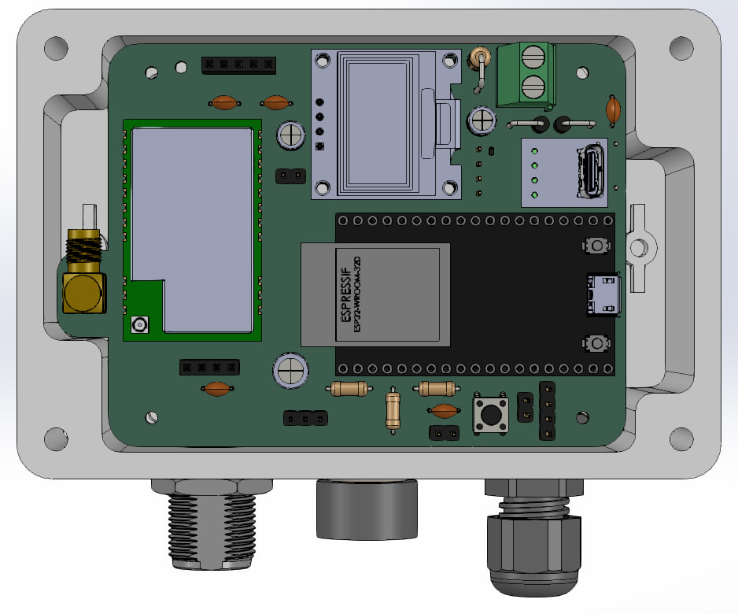
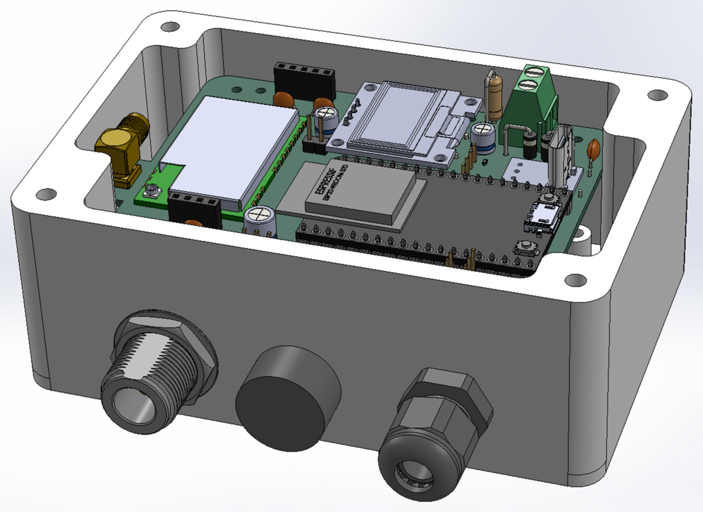
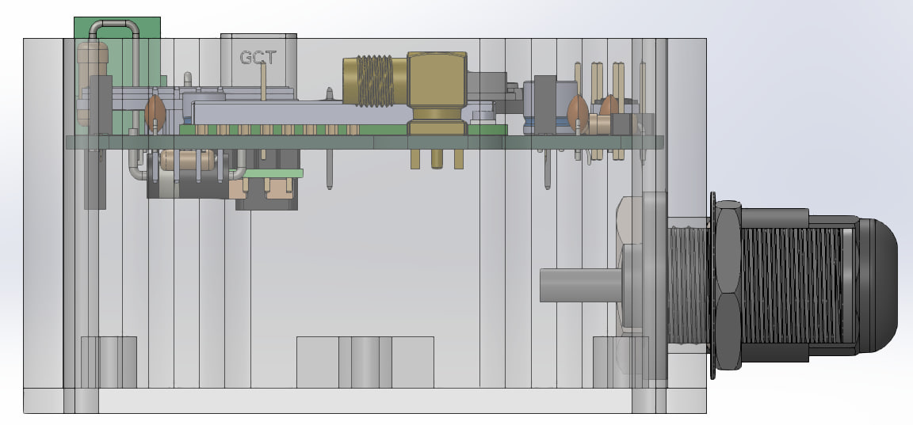

### PDF files for easier viewing

**SCH** = schematic  
**PCB** = board  
**_3D** = 3D files for 360° viewing  
**BOM** = Stückliste

for **3D-PDF**s you can use the **Adobe Acrobar Reader**  
or **PDF Xchange Editor** https://www.pdf-xchange.com/product/pdf-xchange-editor

  
  

